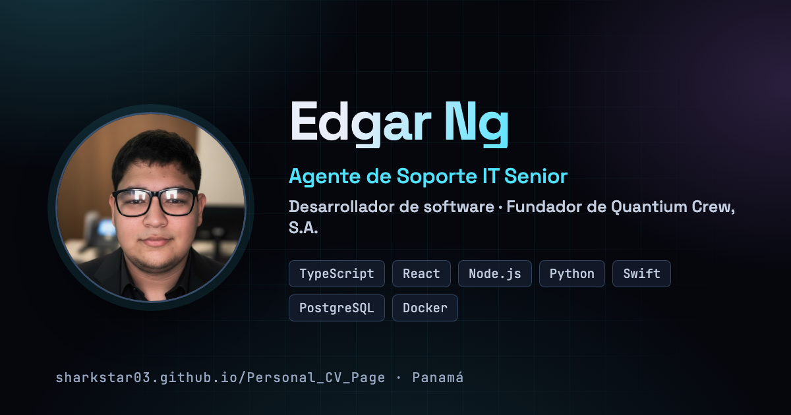

# Personal CV Page — Edgar Ng

Currículum interactivo de **Edgar Alberto Ng Angulo**, con estética cyberpunk sobria,
tema claro/oscuro, conmutador español/inglés y una hoja de impresión que produce un PDF
limpio de una o dos páginas.

**En línea:** <https://sharkstar03.github.io/Personal_CV_Page/>

HTML, CSS y JavaScript puro. Sin frameworks, sin dependencias de terceros en tiempo de
ejecución y sin rastreadores.



## Qué trae

- **Tema claro y oscuro** — sigue `prefers-color-scheme` y recuerda la elección del usuario.
- **Español e inglés** — el español vive en el HTML (para SEO) y el inglés viaja en atributos
  `data-en*`; el conmutador los intercambia sin recargar.
- **Accesibilidad** — enlace de salto, foco visible, `aria` en diálogos con trampa de foco y
  retorno, navegación completa por teclado y soporte de `prefers-reduced-motion`.
- **Impresión** — `@media print` fuerza fondo blanco, oculta lo que sólo sirve en pantalla y
  reorganiza el contenido en A4. `Cmd/Ctrl + P` → *Guardar como PDF*.
- **SEO y compartir** — `lang="es"`, meta description, Open Graph, Twitter Card con imagen
  1200×630, `robots.txt`, `sitemap.xml` y JSON-LD de tipo `Person`.
- **Ligero** — iconos en un sprite SVG en línea, imágenes en WebP, sin CDN de JavaScript.

## Estructura

```
index.html            Contenido y metadatos
css/style.css         Tokens, temas, componentes, responsive e impresión
js/script.js          Tema, idioma, diálogos, scrollspy y fondo de partículas
assets/               Retrato, certificados, favicon e imagen Open Graph
.github/workflows/    Despliegue a GitHub Pages
```

## Desarrollo

No hay build. Basta abrir `index.html` en el navegador, o servirlo:

```bash
python3 -m http.server 8080
```

### Con Docker

```bash
docker compose up --build   # http://localhost:8080
```

## Despliegue

Cada push a `main` publica el sitio en GitHub Pages mediante
`.github/workflows/pages.yml`.

## Pendientes

- Capturas de escritorio, móvil e impresión en el README.
- Auditoría de accesibilidad con lector de pantalla y revisión de desbordamiento en móvil.
- Revisar con el señor si procede reincorporar experiencias que no constan en el expediente
  (Allqui.app y el paso anterior por Farmacia Saba).

## Licencia

[MIT](LICENSE) © Edgar Alberto Ng Angulo.
El contenido del currículum, el retrato y los certificados son personales y no se licencian
para reutilización.
